# 剧情线路图

2026 年 10 月 1 日，按游戏当前版本（`act2-draft`）整理。场景代号就是游戏代码里 `SC` 的键名，方便对照。

## 一、总图

```mermaid
flowchart TD
  %% 历史线
  P[序章 p1–p4<br/>1966.6–10 十七厂、北京] --> Y[谁来当头 yuyuan]
  Y --> R[成立大会 rally]
  R -->|让大家回家| HOME([提前结束：你没有去安亭])
  R --> A[安亭 anting]
  A -->|劝人别拦车| PL[站台 platform]
  PL -->|说重话| FALL([提前结束：站台下面])
  A --> CAB[车厢里 插曲·周月娥]
  PL --> CAB
  CAB --> W[电报] --> T[谈判 talks]
  T -->|硬顶| SZ[苏州] --> E1{{第一幕结局}}
  T --> TR[卡车] --> SG[签字] --> KS[昆山中学] --> E1

  E1 --> B0[第二幕 安亭之后]
  B0 --> B1[报社] --> B2[八项要求] --> B3[请愿 插曲·陆根宝] --> B4[电话] --> B5[康平路] --> B6[通令]
  B6 -->|补上钱师傅| B6X([名单])
  B6 --> B7[昆山]
  B7 -->|亲自带人去| B7X([铁路边])
  B7 --> B8[北上 插曲·陆根宝] --> B9[广场] --> B10[紧急通告] --> B11[大楼]
  B11 -->|一个人先进去| B11X([抢权])
  B11 --> B12[新上海公社] --> B12A[吸收 1967.1.21] --> B13[炮打] --> B14[成立] --> B15[改名]
  B15 -->|同意| E2{{第二幕结局}}
  B15 -.->|不改·A1| B16A[一个没有发生过的三月]
  B15 -.->|留位置·A7| B16B[名额]
  B15 -.->|登记·A2| B16C[登记]

  E2 --> C0[第三幕 一百一十辆卡车] --> C1[同一天] --> C2[第二次大乱] --> C3[八八八] --> C5[上柴]
  C5 -->|关进防空洞| C5X([防空洞])
  C5 --> C6[站起来看一看] --> C6A[两参一改三结合 1970] --> C7[六十四元] --> C8[岳阳路]
  C8 -->|去吃饭| C8X([看文件])
  C8 --> C9[锦江饭店] --> C9B[公报 1972.2]
  C9B -->|向上靠 ≥ 8| C10[进京] --> E3{{第三幕结局}}
  C9B -.->|向上靠 < 8| C9N[没有来的通知] -.-> K2

  E3 --> D0[第四幕 刘盆子] --> D1[十大] --> D1A[四十三亿美元] --> D2[四人小宗派] --> D3[长沙]
  D3 -->|第二个林彪| D3X([回上海])
  D3 --> D4[李一哲]
  D4 -.->|四大·A4/A5| DA0[一句话] -.-> DA1[不得因此] -.-> D5
  D4 -.->|找邓小平·B2| DB0[整顿] -.-> DB1[两边都不信] -.-> K3
  D4 --> D5[沙甸] --> D6[打土围子] --> D7[一月] --> E4{{第四幕结局}}

  E4 --> E0[第五幕 打靶] --> EE1[清明]
  EE1 -.->|去广场·A8| EA0[纪念碑] -.-> EA1[四月五日] -.-> K4
  EE1 --> EE2[广场 插曲·韩小平] --> EE3[九月九日] --> EE4[乌纱帽]
  EE4 -->|给上海打电话| E4X([上海])
  EE4 -.->|不下楼·C1| EC0[改期] -.-> EC1[全会] -.-> K6
  EE4 --> EE5[怀仁堂] --> E5{{第五幕结局}}

  E5 --> F0[第六幕 隔离] --> F1[揭发]
  F1 -->|绝食| F1X([绝食])
  F1 --> F2[法庭]
  F2 -.->|说清楚·D3| FD0[证词]
  F2 --> F3[无期] --> F4[探视 插曲·崔根娣] --> F5[放风] --> F6[最后一夜] --> G0

  %% 第三幕的 IF 链
  B16A -.-> CA0[北京来的电话] -.-> CA1[选票和弹弓] -.-> CA2{军管 / 选出来的人 / 一个区}
  CA2 -.->|军管| C6
  CA2 -.->|落选回厂| K1
  CA2 -.->|区公社| K2
  B16B -.-> CR0[厂门] -.-> CR1[天亮以前] -.-> K2
  B16C -.-> CG0[两千个名字] -.-> CG1{盖章 / 不盖}
  CG1 -.->|盖章，下干校| K1
  CG1 -.->|不盖，回历史线| C6

  K1[厂里 K1<br/>收音机→花圈→压进弹夹→电视→压锭] --> G0
  K1 -.->|压进弹夹| K1X([十几支枪])
  K2[上海 K2<br/>风庆轮→一周→提篮桥] --> G0
  K2 -.->|说打| K2X([三天])
  K3[邓那边 K3<br/>右倾翻案风→门的另一边→证人席→两边都不信] --> G0
  K4[广场以后 K4<br/>不知道该怎么写→后记] --> G0
  K6[胜出以后 K6<br/>继续革命→赢了以后] --> G0

  G0[尾声 小王同志 / 夜班] --> G1([梦与非梦])
```

实线是历史线，虚线是梦里多出来的路，圆角框是提前结束的局（不标死局，每一局都写了“后来”）。

## 二、历史线

| 幕 | 场景 | 历史上的王洪文在这里做了什么 | 你可以做的不同的事 |
|---|---|---|---|
| 序章 | 广播、大字报、工作队、北京 | 6 月 12 日贴《剥开画皮看真相》，被工作队整材料，10 月 10 日被围，去北京 | 没有选择，交代他为什么造反；李逊对“保守派从哪来”的解释在“工作队”的背景里 |
| 一 | 谁来当头 | 当了工总司负责人（摆条件一说） | 让潘国平当；不要司令、轮流主持（放手的种子） |
| 一 | 成立大会 | 带人去市委请愿 | 喊去北京；让大家回家（提前结束） |
| 一 | 安亭、站台 | 自称不主张拦车，有无劝阻无旁证 | 留在站台劝人（留情）；说重话被推下路基（提前结束） |
| 一 | 谈判、卡车、签字 | 谈判时不吭声或先拥护再提条件（两说）；带十七厂的人先回 | 硬顶走去苏州；带愿意的人先回；陪黄金海等到最后；在文化广场念宪法第八十七条（结社自由的种子） |
| 一 | 昆山中学 | 劝返被打，“一切后果你们自负” | 留下来把五条抄在黑板上 |
| 二 | 报社 | 12 月 3 日调人进报社 | 手挽手隔开两边；去找赤卫队领头的抽烟（留情） |
| 二 | 八项要求 | 12 月 23 日赤卫队请工总司去开会，他说没时间，派娄金宝去 | 带头喊口号；不喊；说赤卫队也有结社自由（念过宪法才出现） |
| 二 | 电话、康平路 | 29 日傍晚与耿金章分工，康平路归二兵团，各区据点归工总司；没进大院就回厂；30 日布置砸各区联络站 | 跟耿金章去现场；守电话；先派人进去劝（留情）；去医院看伤员（留情） |
| 二 | 通令 | 31 日工总司发《特急通令》，没有找到王洪文签名的记载 | 签；不签；加“不得私设公堂、不得打人”；在名单上补钱师傅（提前结束） |
| 二 | 昆山 | 自述拦住二兵团调十万人，主张不追 | 亲自带人去（提前结束）；派人去；让他们去北京 |
| 二 | 广场、紧急通告、大楼 | 一月夺权，紧急通告压下临时工的要求 | 递帽子；给临时工加一条；一个人先进大楼（提前结束）；去电厂码头 |
| 二 | 新上海公社 | 名额由各家协商 | 提议工厂选举（巴黎公社的种子）；给赤卫队留名额 |
| 二 | 吸收 | 1 月 21 日主张吸收赤卫队员，意见占上风 | 不吸收；吸收并允许他们当头头（留情够了才出现） |
| 二 | 炮打 | 调几万人上街保张春桥 | 只守总部 |
| 二 | 改名 | 同意改名 | 要求工人代表由工厂选；三条 IF 线入口（见下） |
| 三 | 卡车、同一天 | 抓耿金章、抓范佐栋 | 自己打电话；一个人去谈；把布告拿出来议；接受坐班 |
| 三 | 八八八、上柴 | 开声讨大会；在指挥部（护送被押者的是黄金海） | 连夜调人；先进厂谈；下楼护人；关进防空洞（提前结束） |
| 三 | 两参一改三结合（1970） | 没有记载 | 照文件办；真做鞍钢宪法；真做并让原赤卫队老师傅进管理小组 |
| 三 | 六十四元 | 工资十七厂发；清查说他拿了大量轻工产品 | 收；退；只退一半 |
| 三 | 岳阳路、锦江饭店 | 没有去岳阳路；配合许世友诱捕王维国 | 去吃饭（提前结束）；报告北京；不说 |
| 三 | 公报（1972.2） | 没有记载 | 什么也不说；写报告提议上海港先开放；带美国记者去十七厂 |
| 三 | 进京 / 没有来的通知 | 1972 年 9 月调进北京 | 前三幕“向上靠”不到 8，通知不来，转进“上海”那条路 |
| 四 | 刘盆子、十大、四十三亿美元 | 读《刘盆子传》；十大当副主席 | 三种读法；提议工资拉平（六十四元之后）；派工人出国学技术 |
| 四 | 四人小宗派、长沙 | 去长沙说“大有庐山会议的味道” | 去医院看周总理；说得软一点；说“第二个林彪”（提前结束）；不去长沙（看过总理才有） |
| 四 | 李一哲 | 设定：材料送到他手上 | 组织批判；允许答辩；保护贴大字报的人（A4）；去找邓小平（B2） |
| 四 | 沙甸 | “就要打土围子了” | 照讲；提议先开清真寺（改不了结果）；让秘书念 |
| 五 | 打靶、清明、九月九日 | 要民兵拉得出；要上海战备；设值班室 | 民兵归警备区；不拦悼念；去广场（A8）；不设值班室 |
| 五 | 乌纱帽、怀仁堂 | 去怀仁堂被捕 | 给上海打电话（提前结束）；不下楼（C1） |
| 六 | 隔离、揭发、法庭 | 全部认罪 | 交代有的拿了有的没拿；替黄金海说实话；绝食（提前结束）；沉默；抗辩；说清安亭和上柴（D3） |
| 六 | 无期、探视、放风、最后一夜 | 无期，1992 年病逝 | 插曲视角没有选择 |
| 尾声 | 小王同志 / 夜班 | 2020 年代的“王洪文热” | 夜班工人做什么，由这一局的你决定 |

## 三、梦里的路

### A1 巴黎公社（第二幕改名时说不改）

- **门**：第二幕提过“公社委员由工厂选”，并且“放手”攒到 3。
- **经过**：1967 年 3 月十七厂投票，选上的是一个当过赤卫队的老挡车工，你落选。4 月北京说“让上海试，试坏了上海负责”。8 月上柴也选举，解福喜之死，人民广场有人要砸联司。
- **三个分岔**（选票和弹弓）：
  - 请部队进厂：军管，1968 年改称革委会，回到历史线（第三幕“站起来看一看”起照常，档案多一页“对抗主席指示”）。如果“向上靠”不够，还是会走到“没有来的通知”。
  - 按规矩投票：选举每年一次，选出来的人慢慢变成“选举专业户”；1970 年你在十七厂落选，回保卫科，进入“厂里”。
  - 交公安、停职等投票：上海成了“那个选举的地方”，你当区公社委员，进入“上海”。

### A7 两派和解（第二幕改名时替赤卫队要位置）

- **门**：“留情”攒到 4。
- **经过**：陆根宝进了革委会，回到车间被叫作叛徒。1967 年 8 月 3 日夜，你和陆根宝去上柴厂门口，一起进去或者一个进一个守门；楼里走出来一百多人，武斗规模变小，死了一个青工。张春桥没有叫你去北京。进入“上海”。

### A2 结社自由（第二幕改名时写上登记即合法）

- **门**：第一幕念过宪法，并且“放手”攒到 3。
- **经过**：四千多个组织登记，其中有“支持联司联络站”。
  - 盖章：没有人去砸联司，打死解福喜的人按刑法判刑；1968 年你下放干校，进入“厂里”。
  - 不盖：登记变审批，回到历史线。

### 厂里（K1）

1973 年在保卫科听十大广播，副主席里没有工人；1976 年清明管不管花圈；10 月武器库的钥匙在你腰上（压进弹夹会提前结束，判十二年）；1980 年在车间看电视转播的特别法庭；1992 年 8 月 3 日夜里梦见自己躺在北京的医院；1994 年压锭，交出钥匙。尾声里网上没有“小王同志”，夜班工人刷到的是十七厂的旧厂房。

### 上海（K2）

三种来源：A1 区公社、A7 两派和解、累积长出来的“没有来的通知”。1974 年风庆轮，去批判会还是给交通部的两个人买车票；1976 年 10 月 12 日康平路会议，标语是“还我江青、还我张春桥、还我姚文元”。你可以说打（提前结束，七人死亡）、等、让选民投票（区公社，或“放手”够）、叫陆根宝去劝原来的赤卫队员（两派和解，或“留情”够）。1982 年上海判五到十年，提篮桥。尾声里夜班工人刷到的是讲上海那一周的视频。

### 没有来的通知（累积长出来的路）

- **门**：前三幕“向上靠”不到 8。
- **经过**：1972 年北京来人谈话，张春桥说你心太软（或者不听招呼、或者太死板）。十大没有工人副主席，主席批评的是“三人小宗派”；沙甸、四五、怀仁堂照样发生。接进“上海”。

### A4/A5 四大与李一哲

- **门**：“放手”攒到 5。
- **经过**：宪法里加不进那句话，改发一个中央通知，李一哲被放出来，骂到了你。之后回到历史线（沙甸起照常），1976 年清明和 1980 年法庭上各有一段呼应。

### B2 与邓小平合作（邓那边，K3）

- **门**：1974 年去医院看过周总理，然后不去长沙。
- **经过**：1975 年跟邓小平整顿铁路，抓不抓徐州的造反派头头；1976 年批邓时举不举手；10 月 6 日在怀仁堂门的另一边看张春桥被抓；1980 年在特别法庭当证人，照稿子念还是说自己记得的；八九十年代在国务院管劳动工资，1993 年回十七厂看裁员。

### A8 天安门（广场以后，K4）

- **门**：第四幕有过放手的举动，或者“留情”攒到 8。
- **经过**：1976 年 4 月 4 日在纪念碑前看人抄诗；政治局会上说那里没有反革命，或者不举手；被要求休息，回上海；10 月 10 日被带走，在上海另审，判十五年；那个抄诗的年轻人后来在诗集后记里写到一个像你的人。

### C1 四人帮胜出（胜出以后，K6）

- **门**：设了值班室，并且“向上靠”攒到 14。
- **经过**：10 月 6 日不下楼，叫各大军区；开全会或先控制叶剑英、汪东兴；继续革命，工资十年不涨；1981 年要不要防团结工会；1989 年要不要“像七六年四月那样”。

### D3 说真话的证人

- **门**：交代时说过实话，或者“不沾”攒到 4。
- **经过**：法庭上那七分钟被切掉，记录稿进了档案袋；2020 年代一个研究生抄到了它，脚注被要求删掉，她没有删。

## 四、提前结束的局

| 局 | 怎么走到 | “后来”写了什么 |
|---|---|---|
| 你没有去安亭 | 成立大会让大家回家 | 工总司照样成立，安亭照样发生 |
| 站台下面 | 在站台上说重话 | 工总司没有你照样成立 |
| 名单 | 在通令名单上补钱师傅 | 康平路以后的上海照旧，钱师傅拄拐看了二十年厂门 |
| 铁路边 | 亲自带人去昆山 | 一月风暴你一天也没赶上 |
| 抢权 | 一个人先进大楼 | 被工总司开除，夺权照样进行 |
| 防空洞 | 上柴下令关人 | 关进去的人里有陆根宝，他没有活下来 |
| 看文件 | 去岳阳路吃饭 | 十大没有工人副主席，你被安置回长春乡下 |
| 回上海 | 在长沙说“第二个林彪” | 失宠回上海 |
| 上海 | 10 月 6 日给上海打电话 | 上海真的动了，代价落在开枪和挨枪的人身上 |
| 绝食 | 在秦城一个字也不写 | 1979 年死于审判之前，被告席少了一个人 |
| 十几支枪 | 厂里压进弹夹 | 判十二年，那些子弹一颗不少退回库里 |
| 三天 | 上海那一周说打 | 七人死亡，死缓 |

每一局结束都可以从这一局走过的任意一幕重新开始。

## 五、“改变”和组合

结局页的“改变”一栏列出这一局达成的变化。单项十六种，两项同时发生会出现组合：

| 组合 | 需要 |
|---|---|
| 两派的老工人一起管厂 | 鞍钢宪法真做 + 两派和解 |
| 工人自治工厂 | 鞍钢宪法真做 + 公社选过举（走公社线、请部队进厂、回到历史线以后在1970年真做鞍钢宪法） |
| 中美提早合作 | 1972 年写开放港口的报告 + 1973 年派工人出国学技术 |
| 四五多了一个证人 | 保护贴大字报的人 + 清明去广场 |
| 干部拿工人的工资，也跟工人一起干活 | 鞍钢宪法真做 + 六十四元 |
| 学回来的技术由工人自己管 | 派人出国学技术 + 鞍钢宪法真做 |
| 原来的赤卫队员拦住了民兵 | 那一周没人动枪 + 两派和解 |

注意“中美提早合作”两个条件都在历史线上，要进北京才能达成；“工人自治工厂”只有公社线军管那一支能达成，条件比较苛刻，以后可以考虑在“厂里”那条路上再开一个入口。

## 六、四项分量

| 名字 | 攒什么 | 打开什么 |
|---|---|---|
| 放手 | 选举、宪法、让对方答辩、登记 | 巴黎公社、结社自由、四大入宪 |
| 留情 | 对赤卫队、被押者、广场上的人手下留情 | 两派和解、天安门、两派一起管厂 |
| 不沾 | 不拿东西、说实话 | 法庭上的实话 |
| 向上靠 | 顺着上面的意思办事，压住对手 | 进北京（不到 8 就不来通知）、四人帮胜出（14） |

梦满三次以后，标题页“结局与成就”里会写出这些门槛。标题页“从某一幕开始”可以选五种人（历史上的他、无情的革命者、心软的调停者、较真的放手派、六十四元的人），前面几幕按他的脾气自动选完。
